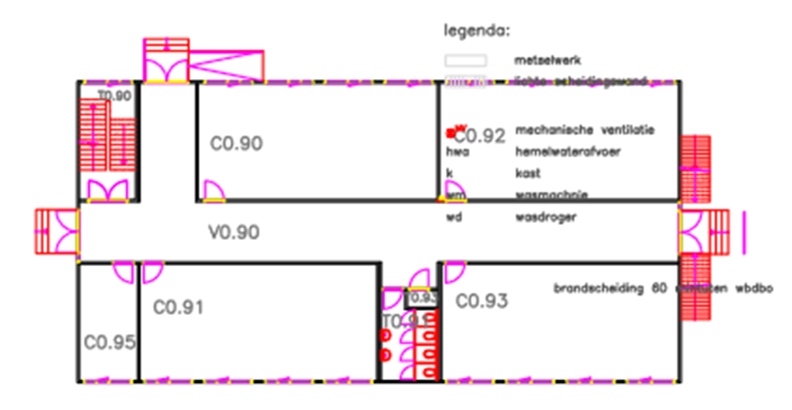
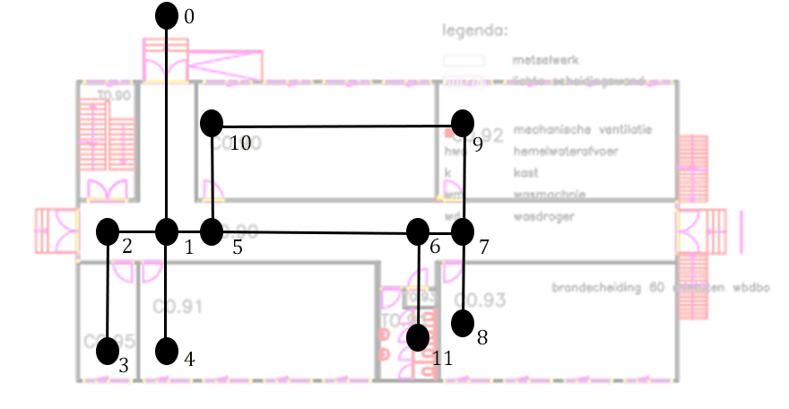
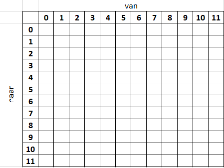

# the Silver Bullet Adventure (SBA)

## stap 1
1. ga uit van een plattegrond

2. geef op de plattegrond posities aan met een stip (vertice)
3. geef de nodes een getal (index)
4. verbind de nodes die met elkaar in contact staan met een lijn (edge)

dit overzicht heet een __graaf__ of in het Engels een __graph__

## matrix

Via een verbingsmatrix kun je aangeven welke punten (vertices) met elkaar verbonden zijn. Op de eerste rij en de eerste kolom worden de index-getallen van de vertrices geplaatst.

In dit geval gaan we er een gerichte matrix van maken. Voeg een kompas-richting toe. Je mag de richting van het noorden zelf kiezen (hoeft dus niet zoals het in werkelijk is).

Nu kun je in een (verbindings)matrix aangeven welke punten met elkaar verbonden zijn en in welke richting

| |0|1|2|3|4|5|6|7|8|9|A|B|
|-|-|-|-|-|-|-|-|-|-|-|-|-|
|0| |N| | | | | | | | | | |
|1|S| |E| |N|W| | | | | | |
|2| |W|E|N| | | | | | | | |
|3| | |S| | | | | | | | | |
|4| |S| | | | | | | | | | |
|5| |E| | | | |E| | | |S| |
|6| | | | | |E| |W| | | |N|
|7| | | | | | | | |N|S| | |
|8| | | | | | | |S| | | | |
|9| | | | | | | |N| | |W| |
|A| | | | | |N| | | |W| | |
|B| | | | | | |S| | | | | |
