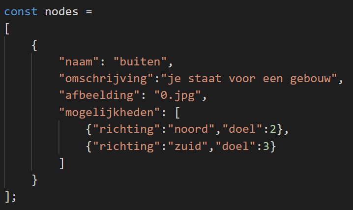

# the Silver Bullet Adventure (SBA)

## stap 1
1. ga uit van een plattegrond

2. geef op de plattegrond posities aan met een stip (vertice)
3. geef de nodes een getal (index)
4. verbind de nodes die met elkaar in contact staan met een lijn (edge)

dit overzicht heet een __graaf__ of in het Engels een __graph__

## json
Beschrijf elke node zodat deze informatie in een json-object kan worden opgenomen

## matrix

Via een verbingsmatrix kun je aangeven welke punten (vertices) met elkaar verbonden zijn. Op de eerste rij en de eerste kolom worden de index-getallen van de vertrices geplaatst.

Nu kun je in een (verbindings)matrix aangeven welke punten met elkaar verbonden zijn en in welke richting

